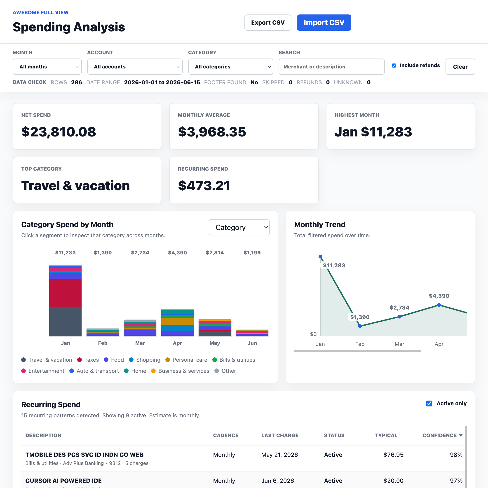
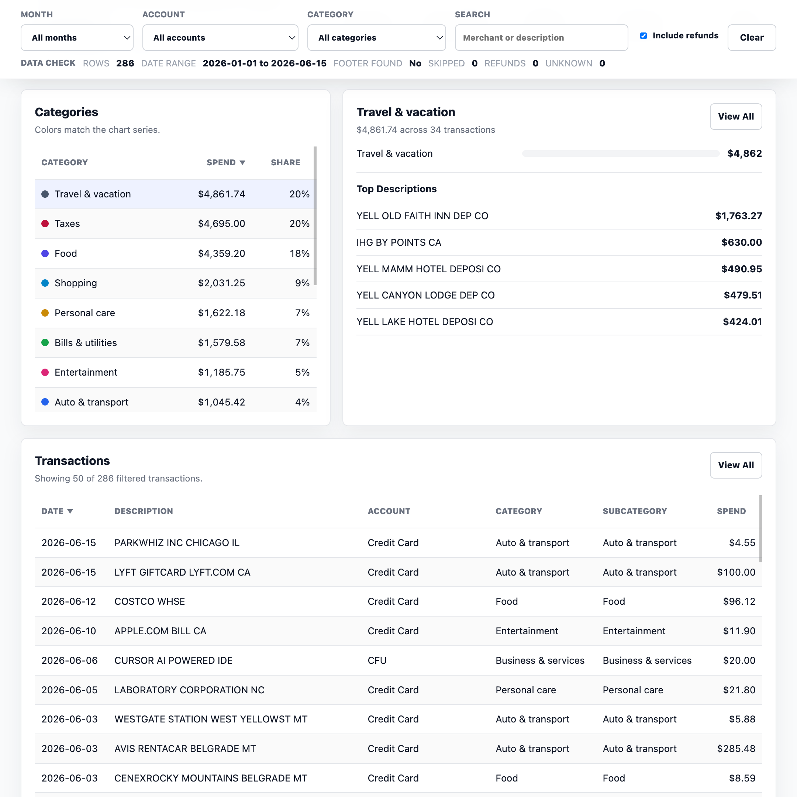

# Full View Spending

Chrome extension for local Fidelity Full View spending analysis.

## Chrome Extension

1. Select the desired date range in Fidelity Full View Spending
2. Use the extension popup to refresh from Fidelity's currently selected view. 
3. Open the extension dashboard to view your data

The extension does not handle Fidelity credentials.

## What It Shows

It shows data that the original Fidelity fullview doesn't have:

- Recurring Spend
- Category or subcategory spend by month.
- Monthly spend trend.

### Dashboard UI





## Local Development

The dashboard can still be served locally for UI work:

```sh
python3 -m http.server 5173
```

Then open:

```text
http://127.0.0.1:5173/
```